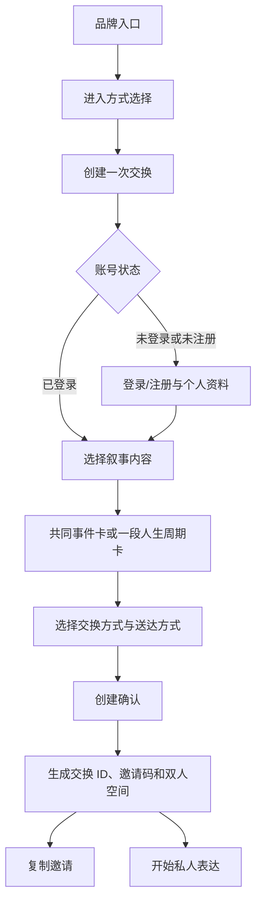
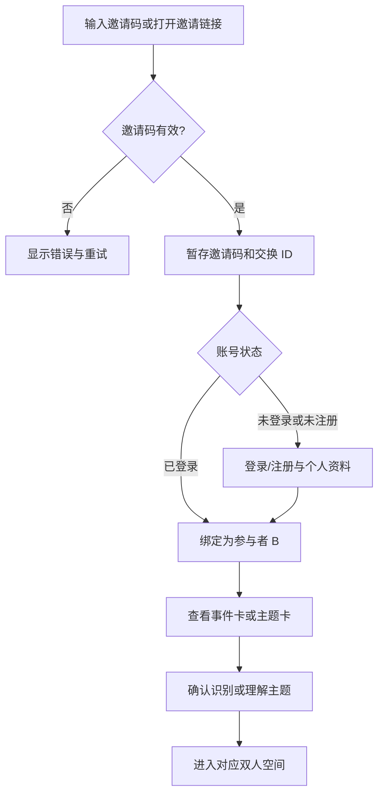
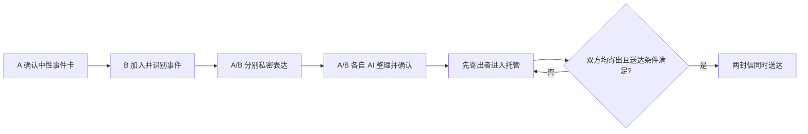
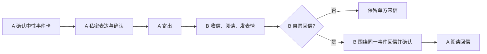
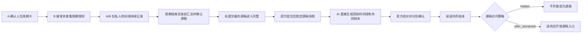
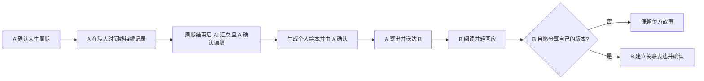
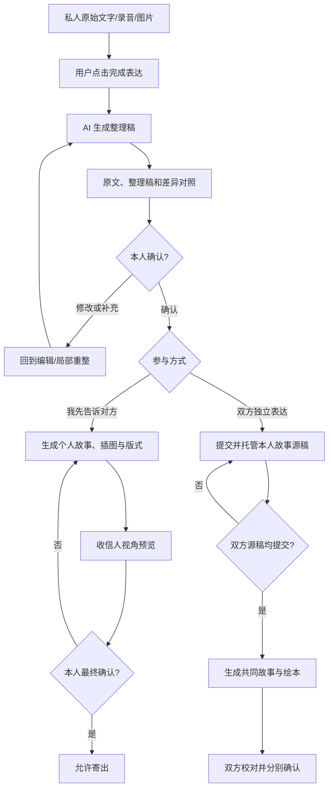
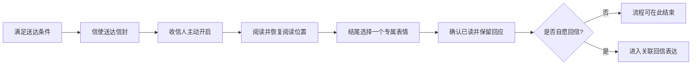
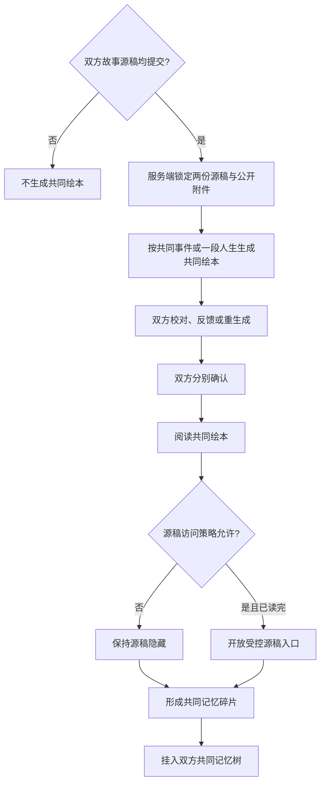

# 用户流程

## 1. 普通用户创建交换

## 2. 邀请码加入

异常包括无效、失效、已使用、自己的邀请码、交换取消或结束；邀请码回跳不得因登录注册丢失。

## 3. 四种核心组合

### 3.1 共同事件＋双方独立表达

### 3.2 共同事件＋我先告诉对方

### 3.3 一段人生＋双方独立表达

### 3.4 一段人生＋我先告诉对方

## 4. AI 整理与本人确认

任何未确认结果均保持私密，不能寄出或参与交汇。

## 5. 送达、阅读与表情回应

## 6. AI 视角交汇、记忆碎片与记忆树

