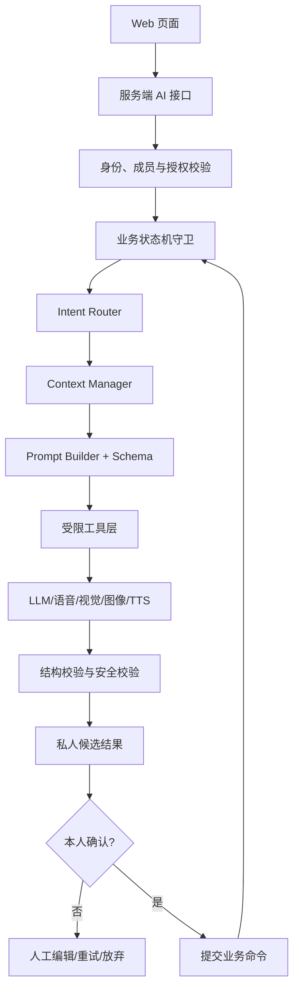

# AI Agent 架构与触发规则

## 1. 定位与边界

《交换人生》的 Agent 不是通用聊天机器人，也不提供开放域闲聊。它是由业务状态机编排、在用户明确授权范围内调用受限工具的服务端能力层。

Agent 必须同时满足三类约束：

1. **业务状态**：当前交换、草稿、信件和交汇状态允许执行该能力；
2. **用户授权**：当前用户主动触发，或已满足且未关闭轻提示规则；
3. **隐私权限**：输入属于当前用户，或已被双方正式公开并允许用于指定共同能力。

LLM 不能直接改变业务状态、公开内容、寄出信件、确认阅读、创建共同记忆或扩大数据可见范围。

## 2. 总体架构



服务端按最小必要原则装配输入。前端不能传入任意数据引用要求 Agent 越权读取；所有引用须由服务端重新解析并校验归属和状态。

## 3. Intent Router

Intent Router 只识别产品允许的封闭意图集合：

| 意图 | 说明 | 允许来源 |
|---|---|---|
| `summarize_context` | 回顾本人已经表达的内容和停留位置 | 表达工作区主动唤醒或合规停顿提示 |
| `request_gentle_prompt` | 给一个恢复叙述的轻量问题 | 本人主动请求；一次一个问题 |
| `transcribe_audio` | 转写本人录音并标记不确定段 | 本人完成录音后触发 |
| `understand_image` | OCR、物件、场景与显式时间线索识别 | 本人上传图片后触发 |
| `organize_narrative` | 将本人选择的材料整理成候选稿 | 本人点击“完成表达” |
| `summarize_journey` | 汇总本人的人生周期记录并生成时间线候选 | 周期结束且本人主动触发 |
| `generate_letter` | 兼容旧 Demo 的信件包装能力，正式实现映射到个人绘本 | 单方模式且整理稿已由本人确认 |
| `generate_personal_storybook` | 基于单方确认源稿生成个人故事与绘本 | 单方模式且本人已确认源稿 |
| `generate_joint_storybook` | 基于双方已提交源稿快照生成共同故事与绘本 | 双方模式且服务端已锁定两份公开快照 |
| `generate_illustration` | 基于本人确认的关键画面生成叙事插图 | 本人选择画面和风格后 |
| `read_letter` | 朗读已送达的最终公开信件 | 收信人主动点击“听这封信” |
| `generate_intersection` | 兼容旧 Demo 的视角交汇能力，正式实现映射到共同故事 | 双方源稿均提交并锁定公开快照 |
| `retrieve_memory` | 从授权记忆中返回可引用片段 | 未来能力；当前 Demo 仅模拟 |
| `unsupported` | 不属于上述集合 | 拒绝执行并返回可用能力提示 |

Router 只分类和抽取有限参数，不负责判断是否可执行。权限校验与业务状态守卫必须在 Router 前后各有明确检查。

## 4. 有限多轮对话

Agent 只在完成当前任务所需的有限轮次内提问，不形成持续聊天：

- 共同事件卡缺少必要边界时最多追问 1–2 个问题；每轮只问一个。
- 表达陪伴一次只给一个问题，用户可不回答、关闭或结束本轮。
- 图片/语音低置信内容只请求用户校正具体片段，不延伸分析关系或情绪。
- 叙事整理信息不足时保留“不确定”，不得通过连续追问逼迫补全。
- 每个会话绑定 `taskId`、`intent`、`ownerId` 和允许的数据引用；切换意图时结束旧任务并重新授权。
- 达到轮次上限、用户拒绝、状态变化或权限失效时立即停止。

## 5. Context Manager

Context Manager 按能力创建隔离的上下文包：

| 上下文范围 | 可包含 | 不可包含 |
|---|---|---|
| 个人表达 | 本人的前置卡、草稿、选定录音转写、OCR、图片说明、本人修订 | 对方草稿、对方进度、未授权历史记忆 |
| 信件生成 | 本人已确认正文、本人确认的画面/原图公开选择 | 未确认草稿、被删除版本、对方私人内容 |
| 读信 | 当前已送达信件最终正文、收信人播放偏好 | 草稿、AI 摘要、其他信件 |
| 视角交汇 | 双方最终公开信件固定版本、主动公开附件 | 原始录音、原图默认版本、私人草稿、工作摘要、否定版本、表情心理推断 |
| 记忆检索 | 未来由权限过滤器返回的本人私有或双方共同记忆片段 | 未授权另一方私有内容、已撤回/隐藏内容 |

上下文应带来源 ID、版本、归属、可见性和用途标签。任务完成后不把完整上下文写入普通应用日志。

## 6. 触发规则

### 主动唤醒

用户点击 AI 陪伴入口后，可选择回顾、梳理、一个小提示或暂停。前端发送明确意图，服务端验证当前草稿属于本人且状态允许。

### 停顿触发

只有同时满足以下条件才显示轻提示：已有有效内容、连续停顿 10–15 分钟、页面在前台、当前未录音、本次停顿未提示过、用户未关闭提醒。提示仅建议用户主动唤醒 Agent；不能直接把草稿发给模型。用户继续输入、关闭或忽略后提示消失。

### 禁止自动触发

不得在持续输入时分析，不得自动整理、自动生成信件、自动寄出、自动朗读、自动交汇或自动检索历史记忆。

## 7. 多模态工具

| 工具 | 输入 | 输出 | 关键约束 |
|---|---|---|---|
| 文本处理 | 本人选择的草稿版本 | 分段、摘要、候选整理稿 | 保留原始版本和不确定性 |
| 语音转写 | 私有录音对象引用、语言偏好 | 原话转写、书面版本、时间码、低置信片段 | 不猜测；原音不默认公开 |
| 图片理解 | 私有图片对象引用、本人说明 | OCR、显式场景/物件/时间线索、低置信区域 | 不推断关系、心理或事件真相 |
| 图像生成 | 已确认画面描述、风格与人物限制 | 标明为叙事插图的候选资产 | 不擅自生成可识别真人 |
| TTS | 已送达最终正文、声音与语速 | 音频及文字时间轴 | 不改写原文、不自动播放 |
| 记忆检索 | 授权主体、范围、查询、用途 | 带来源和权限标签的片段 | 当前只定义接口，未来接入 |

## 8. 三条生成流水线

### 8.1 叙事整理

`选择私人材料 → 权限校验 → 多模态文本标准化 → 结构化整理 → Schema 校验 → 私人候选稿 → 差异对照 → 本人编辑与确认`

本人确认前不得进入信件生成。补充或修改原始内容后，旧整理稿标记为过期。

### 8.2 个人故事与绘本生成

`单方模式已确认源稿 → 提取候选关键画面 → 本人选择 → 生成个人故事、插图和版式 → 完整预览 → 本人最终确认 → 状态机允许寄出`

文字为唯一内容主版本。任何精简都产生新候选版本并再次确认；原图公开是独立选择。

### 8.3 共同故事与绘本生成

`服务端校验双方源稿均已提交 → 固定公开来源快照 → 按共同事件或一段人生选择 Prompt → 结构化共同故事 → 事实/引用校验 → 共同插图与版式 → 双方校对/重生成 → 双方分别确认 → 状态机创建记忆碎片`

共同事件与一段人生使用不同输出结构。生成失败不修改两份源稿，不创建记忆碎片；未获得双方确认的候选结果不得标记为共同记忆。

### 8.4 一段人生与绘本分支

一段人生先按记录归属筛选本人的 `journey_entries`，再生成个人时间线与故事源稿候选。单条记录完成不触发整段汇总，也不能把另一方记录装入上下文。

- 单方模式：`本人确认源稿 → 个人故事结构 → 画面候选 → 本人确认绘本 → 允许送达`。
- 双方模式：`双方分别确认源稿 → 服务端锁定两份公开快照 → 共同故事与双轨时间线 → 共同插图 → 双方逐段校对与分别确认 → 允许归档`。

双人模式不得先调用个人绘本任务，也不得将任一方的私人 AI 引导上下文直接传给共同故事 Agent。共同任务只接收双方提交后的 `story_sources` 和明确公开附件。

## 9. Prompt 工程与结构化输出

每个 Prompt 由固定层次构成：角色边界、允许任务、禁止行为、输入来源及权限标签、输出 JSON Schema、保留不确定性规则、引用要求和失败返回规则。

- Prompt 不接受前端自由拼接的系统指令；用户文本始终作为数据字段传递。
- 输出必须通过运行时 Schema 校验；禁止依赖自然语言解析关键业务状态。
- 每个事实性段落保留 `sourceRefs`；无法定位来源时标记 `uncertain` 或不输出。
- 使用枚举值表达意图、状态和错误码；展示文案与机器状态分离。
- Schema 不通过时先执行一次结构修复；仍失败则进入可重试错误，不保存为有效候选。

建议通用结果外壳：

```json
{
  "schemaVersion": "1.0",
  "taskId": "task_demo_001",
  "status": "success",
  "data": {},
  "warnings": [],
  "sourceRefs": []
}
```

## 10. 状态机与 LLM 的职责分界

| 必须由确定性状态机/服务完成 | 可交给 LLM 生成候选 |
|---|---|
| 身份、成员、权限和授权校验 | 意图分类（封闭枚举） |
| 邀请绑定、寄出、托管和原子送达 | 上下文摘要和一个轻量问题 |
| 是否满足整理、读信、交汇和记忆条件 | 转写/OCR 后的候选修订 |
| 内容版本、公开范围和来源快照 | 叙事整理、信件结构和插图提示 |
| 已读、回应、回信关联和幂等 | 两封公开信的结构化交汇候选 |
| 重试次数、超时、错误状态和回滚 | 记忆检索结果的摘要（未来） |

## 11. 必须本人确认的操作

- 中性事件卡与自定义主题卡；
- 语音转写校正、图片说明及原图公开选择；
- AI 叙事整理稿及任何精简版本；
- 关键画面、生成插图、版式和最终收信人预览；
- 寄出动作；
- 对交汇问题段落的反馈、隐藏或重生成请求。

交汇是双方共同结果，不允许一方修改为代表另一方的事实；具体共同版本争议规则仍需产品确认。

## 12. 失败、超时与重试

统一状态为 `idle → loading → success | error | timeout`。失败或超时保留原始材料与最近人工编辑；重试创建新任务并引用同一输入版本，不覆盖失败记录。用户可放弃 AI，回到人工编辑；图像、TTS 等附加能力失败不得阻塞纯文字主流程。

## 13. RAG 未来接入边界

当前 Demo 的 `retrieve-memory` 只返回固定模拟数据，不接向量库。未来接入须满足：

1. 分开建立“本人私有索引”和“双人共同索引”，不得建立无权限边界的全局关系索引；
2. 只有本人可检索私人材料；共同索引只包含双方最终公开信、交汇和共同记忆碎片；
3. 查询时先做结构化权限过滤，再做向量/关键词检索，不能检索后才过滤；
4. 结果必须返回来源、版本、归属、可见性和可撤回状态；
5. 检索结果不自动写入新信件、Prompt 长期记忆或共同记忆，仍需本人选择与确认；
6. 删除、撤回、账号注销、保留期限和重新索引策略在产品确认前不得上线。
