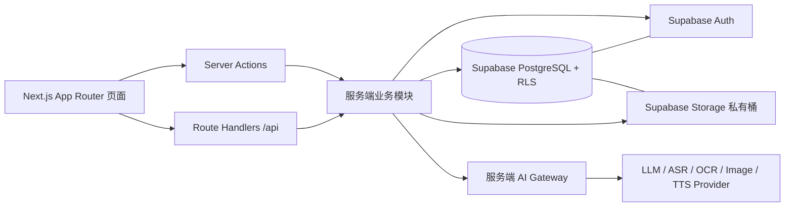

# Next.js + Supabase 全栈一体架构

## 1. 架构目标

《交换人生》的核心风险不是页面复杂度，而是隐私边界和状态转换。正式架构应把“谁能看什么、何时送达、AI 能读哪些材料”放在受信任服务端和数据库权限中，而不是只靠前端隐藏。

本项目建议采用 **Next.js 全栈一体架构**：

- **应用框架**：Next.js App Router + TypeScript。
- **前端 UI**：React Server Components + Client Components，桌面 Web 优先。
- **服务端能力**：Next.js Route Handlers、Server Actions 和服务端模块承载受信任业务逻辑。
- **数据与身份**：Supabase Auth + PostgreSQL + Row Level Security。
- **文件存储**：Supabase Storage 私有桶 + 服务端签发短时上传/下载 URL。
- **AI 能力**：Next.js 服务端统一封装 AI 网关；浏览器不持有任何 AI provider key。

这不是“React 前端 + 独立 Node API”的前后端分离方案。Next.js 项目本身就是产品应用和服务端业务入口；Supabase 作为托管数据、鉴权和存储底座。

当前仓库的 Vite/React Demo 可作为第一版交互原型。正式化时建议迁移到 Next.js，而不是继续扩展成独立前端应用。

## 2. 总体分层



关键原则：

- 页面、接口和业务逻辑在同一个 Next.js 应用内组织。
- 只有 Client Components 运行在浏览器；业务命令、权限判断、AI 调用和签名 URL 都在服务端执行。
- Supabase RLS 是数据库层防线，Next.js 服务端业务校验是应用层防线，两者同时存在。
- 前端可在本人草稿页做本地临时恢复，但正式状态以服务端和 Supabase 为准。

## 3. Next.js 职责划分

### 3.1 Server Components

适合承载：

- 已登录后的页面数据读取；
- 交换空间、信件列表、记忆碎片等可服务端渲染内容；
- 基于当前用户权限返回的页面级 DTO；
- 不含浏览器交互状态的页面骨架。

Server Components 只能读取当前用户有权限的数据投影，不应直接把数据库整行传给 Client Components。

### 3.2 Client Components

适合承载：

- 长文本编辑器、录音控件、图片选择、阅读进度、动画和可访问性开关；
- 表单交互、局部状态、乐观 UI；
- 调用 Server Actions 或 `/api` Route Handlers；
- 本人草稿的短期本地恢复。

Client Components 不得持有 service role key、AI key，也不得直接拼接私有存储路径访问文件。

### 3.3 Server Actions

适合承载与页面表单紧密相关的业务命令：

- 创建交换；
- 更新前置卡；
- 保存和确认草稿；
- 确认寄出；
- 阅读确认和发送主要回应；
- 保存交汇结果为共同记忆。

Server Actions 内部必须调用服务端业务模块，不能把复杂状态机逻辑散落在页面文件里。

### 3.4 Route Handlers

适合承载：

- AI 异步任务；
- 媒体上传/读取签名 URL；
- Webhook；
- 需要流式返回或轮询状态的接口；
- 未来移动端或外部客户端复用的 API。

Route Handlers 仍属于同一个 Next.js 应用，不代表独立后端服务。

## 4. 服务端业务模块

建议在 Next.js 项目内保留清晰的服务端目录，例如 `src/server/`。这些模块只允许被 Server Components、Server Actions 和 Route Handlers 引用，不进入浏览器 bundle。

```text
src/
  app/
    (public)/
    (app)/
    api/
  components/
  features/
  server/
    config/
      env.ts
      supabase.ts
    auth/
      session.ts
      guards.ts
    domain/
      state-machine.ts
      permissions.ts
      idempotency.ts
      errors.ts
    modules/
      profiles/
      exchanges/
      invites/
      drafts/
      media/
      letters/
      reactions/
      convergence/
      memory/
      ai/
    db/
      queries/
      transactions/
```

服务端业务模块负责：

- 验证 Supabase 会话和当前用户；
- 校验空间成员资格、内容归属和状态转换合法性；
- 执行邀请码领取、信件托管、双方同时送达等事务；
- 为私有媒体生成短时签名 URL；
- 按最小必要原则组装 AI 输入；
- 返回当前用户视角的 DTO。

## 5. Supabase 职责

Supabase 是身份、数据、存储和权限底座。

- **Auth**：用户注册、登录、会话、JWT。
- **PostgreSQL**：保存产品实体、状态、版本、公开快照和审计记录。
- **RLS**：限制本人私有内容、空间成员内容和送达后内容。
- **Storage**：保存录音、图片、生成插图、TTS 音频等大对象。
- **Database Functions 可选**：用于原子送达、邀请码领取等强事务逻辑；也可先由 Next.js 服务端事务封装。

数据模型以 `docs/technical/data-schema.md` 为准。需要特别保持：

- `narrative_type` 与 `exchange_method` 分开存储，不绑定组合；
- `drafts`、`draft_versions`、`media_assets`、`ai_working_summaries` 默认本人私有；
- `letters` 在送达前不能向收信人泄露正文；
- `convergences.source_snapshot` 必须证明只使用最终公开来源；
- `memory_fragments` 是双方共同实体，不是任一方的私有副本。

## 6. 推荐路由结构

正式 Next.js 路由可与现有页面地图对应。

```text
src/app/
  page.tsx                         # 品牌入口
  start/page.tsx
  auth/page.tsx
  onboarding/profile/page.tsx
  join/page.tsx
  exchanges/
    new/
      content/page.tsx
      event/page.tsx
      theme/page.tsx
      method/page.tsx
      review/page.tsx
    [exchangeId]/
      page.tsx
      invite/page.tsx
      context/page.tsx
      write/page.tsx
      organize/page.tsx
      compose/page.tsx
      preview/page.tsx
      sent/page.tsx
      delivery/[letterId]/page.tsx
      letters/[letterId]/page.tsx
      letters/[letterId]/respond/page.tsx
      convergence/page.tsx
      memory/page.tsx
  spaces/[spaceId]/tree/page.tsx
  settings/profile/page.tsx
  settings/messenger/page.tsx
  api/
    media/upload-url/route.ts
    media/read-url/route.ts
    ai/organize-narrative/route.ts
    ai/generate-convergence/route.ts
```

比赛 Demo 可以暂时保留 `/demo-control`，但正式导航不展示。

## 7. 推荐服务端接口边界

一体化架构中，业务命令优先使用 Server Actions；需要异步、流式、文件签名或外部复用时使用 Route Handlers。

| 能力 | 推荐入口 | 说明 |
|---|---|---|
| 创建交换 | Server Action `createExchangeAction` | 创建两维度、前置卡草稿和送达设置 |
| 领取邀请码 | Server Action 或 `POST /api/invites/claim` | 强校验一次性绑定 |
| 保存草稿 | Server Action `saveDraftAction` | 只保存当前用户自己的草稿 |
| 媒体上传签名 | `POST /api/media/upload-url` | 限定 bucket、路径、类型和大小 |
| AI 整理 | `POST /api/ai/organize-narrative` | 可异步返回任务状态 |
| 确认整理 | Server Action `confirmDraftAction` | 本人确认后进入信件生成 |
| 寄出信件 | Server Action `sendLetterAction` | 服务端检查确认状态和送达规则 |
| 阅读确认 | Server Action `ackLetterAction` | 幂等写入阅读状态 |
| 主要回应 | Server Action `reactToLetterAction` | 每人每信一个主要回应 |
| 生成交汇 | `POST /api/ai/generate-convergence` 或 Server Action | 服务端重新校验公开信与双向已读 |
| 创建记忆碎片 | Server Action `saveMemoryFragmentAction` | 只在交汇成功后创建一次 |

所有返回值都应是当前用户可见的 DTO。比如对方状态只返回粗粒度枚举，不返回字数、保存时间、媒体数量或 AI 任务状态。

## 8. 核心事务

以下流程必须在服务端事务或数据库函数中完成：

- **领取邀请码**：校验 code hash、未过期、未领取、不是创建者本人、交换未取消；同时创建 B 成员并标记邀请码已领取。
- **双方同时送达**：确认两封信均已寄出且满足预约条件后，在同一事务中同时写入 `delivered_at`。
- **阅读确认与回应**：先确认收信权限和信件已送达，再幂等写入阅读状态和主要回应。
- **交汇生成资格**：重新查询双方最终公开信和双向已读，固定 `source_snapshot` 后再调用 AI。
- **记忆碎片创建**：只在交汇成功后创建一次，重复请求返回已有碎片。

这些事务不能只靠前端按钮状态控制。

## 9. AI 网关边界

AI 网关位于 Next.js 服务端模块中。

- 每项能力使用独立服务函数，例如 `organizeNarrative`、`understandImage`、`generateConvergence`。
- 服务端按能力从数据库读取允许的最小输入，不信任客户端传来的正文或对象路径。
- AI 结果先保存为私人候选版本；本人确认后才进入正式信件流程。
- 视角交汇只能读取双方最终公开信件的固定快照。
- 日志只记录任务 ID、能力、状态、错误码和数据引用，默认不记录完整私人正文。

建议 AI 相关 Route Handlers 返回统一任务外壳，与 `docs/technical/ai-mock-contracts.md` 保持一致。

## 10. 环境变量边界

可暴露给浏览器：

- `NEXT_PUBLIC_SUPABASE_URL`
- `NEXT_PUBLIC_SUPABASE_ANON_KEY`

仅服务端可见：

- `SUPABASE_URL`
- `SUPABASE_SERVICE_ROLE_KEY`
- `SUPABASE_JWT_SECRET` 或 Supabase JWKS 配置
- `AI_PROVIDER_API_KEY`
- `SIGNED_URL_TTL_SECONDS`
- `DATABASE_URL`（如选择直连 Postgres）

任何 service role key、AI key、私有存储路径签名逻辑都不能进入 Client Components。

## 11. Demo 到正式架构的迁移顺序

1. 新建 Next.js App Router 项目结构，迁移现有 React 页面组件和样式。
2. 将页面按 `src/app` 路由拆分，保留 Demo 数据层作为临时 adapter。
3. 增加 Supabase Auth，先完成真实登录、资料和会话恢复。
4. 在 `src/server/domain` 固化状态机、权限守卫和幂等工具。
5. 接入 Supabase 表和 RLS，优先实现 Profile、Exchange、Invite。
6. 接草稿、整理候选、信件和送达事务，替换 `localStorage` 主状态。
7. 接 Storage 私有桶和媒体签名 URL。
8. 接 AI 网关，先实现整理和交汇；语音、OCR、图像和 TTS 可继续 Mock。
9. 增加权限测试、状态机测试和 AI 边界测试。

比赛阶段不需要一次性完成全部真实后端，但架构讲述应明确：当前本地 Demo 是过渡适配器，正式安全边界在 Next.js 服务端和 Supabase RLS。
