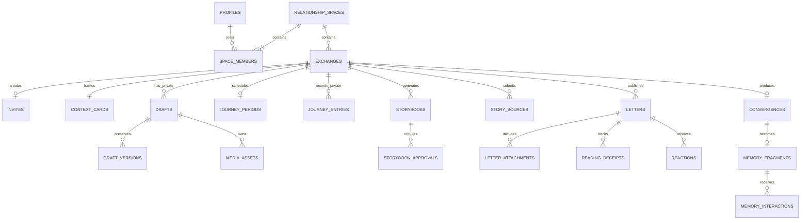

# Supabase 数据模型草案

本文件只描述设计，不创建真实数据库。建议使用 UUID 主键、`timestamptz` 时间字段和 Supabase Auth 的 `auth.users.id` 作为用户身份来源。

## 1. 主要表

| 表 | 关键字段 | 关联与用途 | 数据归属/可见性 |
|---|---|---|---|
| `profiles` | `user_id`, `nickname`, `avatar_path`, `profile_completed_at` | 一对一关联 Auth 用户 | 本人可编辑；参与共同交换时对对方展示昵称和头像 |
| `messenger_profiles` | `id`, `user_id`, `preset_key`, `preferences`, `is_active` | 用户的记忆信使 | 本人管理；送信和回应时对交换对象可见 |
| `relationship_spaces` | `id`, `created_by`, `status`, `created_at` | 双人空间 | 仅两名成员可见 |
| `space_members` | `space_id`, `user_id`, `role`, `joined_at` | 唯一 A/B 成员；联合唯一约束 | 仅空间成员可见 |
| `exchanges` | `id`, `space_id`, `creator_id`, `narrative_type`, `exchange_method`, `delivery_mode`, `source_access_policy`, `scheduled_at`, `status` | 一次交换；两个选择维度和源稿访问策略分别存储 | 仅 A/B 可见；状态按粗粒度投影给对方 |
| `invites` | `id`, `exchange_id`, `code_hash`, `status`, `expires_at`, `claimed_by`, `claimed_at` | 一次性邀请码；服务端校验 | A 可查看可分享码；B 仅在领取时使用；不存明文长期查询值为佳 |
| `context_cards` | `id`, `exchange_id`, `type`, `title`, `description`, `time_hint`, `place_hint`, `theme_key`, `confirmed_at` | 中性事件卡或主题卡 | A 确认后 A/B 可见；确认前仅 A |
| `journey_periods` | `id`, `exchange_id`, `starts_at`, `ends_at`, `end_mode`, `status`, `extended_at` | 一段人生的周期边界和延期状态 | A/B 可见周期规则；修改关键规则需双方确认 |
| `journey_entries` | `id`, `exchange_id`, `owner_id`, `occurred_at`, `title`, `text`, `place_hint`, `include_in_story`, `status` | 一段人生中的多条私人记录 | 仅本人；对方不可读取数量、日期和内容 |
| `drafts` | `id`, `exchange_id`, `owner_id`, `status`, `current_text`, `cursor_state`, `last_saved_at` | 每人私人表达工作区 | 仅本人；对方和交汇均不可读 |
| `draft_versions` | `id`, `draft_id`, `kind`, `content`, `created_at` | 原始、编辑中、AI 整理等版本 | 仅本人；未确认版本不可公开 |
| `media_assets` | `id`, `draft_id`, `owner_id`, `storage_path`, `media_type`, `visibility`, `metadata`, `deleted_at` | 原音、图片、生成插图 | 私有桶对象默认本人；`visibility=published` 才能随信授权 |
| `transcripts` | `id`, `media_asset_id`, `raw_text`, `edited_text`, `language`, `confidence`, `status` | 录音转写、方言标记 | 仅本人 |
| `image_analyses` | `id`, `media_asset_id`, `ocr_text`, `description`, `confidence`, `status` | OCR 与受限图片理解 | 仅本人；除非内容明确进入最终公开附件说明 |
| `ai_working_summaries` | `id`, `draft_id`, `summary`, `created_at` | 上下文总结、停留位置 | 仅本人；交汇不可读 |
| `ai_runs` | `id`, `owner_id`, `exchange_id`, `capability`, `input_refs`, `status`, `error_code`, `created_at` | 服务端 AI 作业审计；避免复制敏感正文到日志 | 任务所有者可见必要状态；服务端管理 |
| `letters` | `id`, `exchange_id`, `sender_id`, `recipient_id`, `reply_to_letter_id`, `status`, `confirmed_text`, `layout`, `sent_at`, `delivered_at` | 最终信件及回信链 | 寄出前仅本人；送达后收信人可见；交汇只读公开字段 |
| `story_sources` | `id`, `exchange_id`, `owner_id`, `source_type`, `content`, `source_refs`, `version`, `status`, `submitted_at` | 用户确认并允许进入生成的故事源稿快照 | 提交前仅本人；按单方送达或双方揭晓条件公开 |
| `storybooks` | `id`, `exchange_id`, `kind`, `status`, `content`, `layout`, `source_snapshot`, `generated_at` | `personal` 个人绘本或 `joint` 共同绘本 | 个人绘本按送达权限；共同绘本按双方提交和校对状态 |
| `storybook_approvals` | `storybook_id`, `user_id`, `status`, `feedback`, `approved_at` | 共同绘本的逐人确认与问题反馈 | 仅交换双方可写本人审批；联合唯一约束 |
| `storybook_reading_receipts` | `storybook_id`, `reader_id`, `opened_at`, `completed_at`, `last_position` | 共同绘本逐人的阅读完成和位置 | 读者可写本人记录；用于 `after_storybook` 源稿门禁 |
| `letter_attachments` | `letter_id`, `media_asset_id`, `position`, `caption`, `is_public` | 最终公开附件清单 | 仅 `is_public=true` 且信件送达后对方可见 |
| `delivery_batches` | `id`, `exchange_id`, `mode`, `scheduled_at`, `status` | 双方独立表达的原子送达批次 | A/B 可见粗粒度状态 |
| `delivery_items` | `batch_id`, `letter_id`, `status`, `delivered_at` | 批次包含的信件 | 依信件权限 |
| `reading_receipts` | `id`, `letter_id`, `reader_id`, `opened_at`, `acknowledged_at`, `last_position` | 打开、阅读位置和已读确认 | 读者可写；寄信人只看允许的已读状态 |
| `reactions` | `id`, `letter_id`, `sender_id`, `reaction_key`, `created_at` | 每次阅读的主要专属表情 | 双方可见；每人每信限制一个主要回应 |
| `convergences` | `id`, `exchange_id`, `type`, `status`, `content`, `source_snapshot`, `generated_at` | AI 视角交汇 | 条件满足后双方可见；来源必须是公开信件快照 |
| `convergence_feedback` | `id`, `convergence_id`, `user_id`, `segment_ref`, `reason`, `status` | 错误标记、隐藏或重生成请求 | 双方可提交和查看必要状态 |
| `memory_fragments` | `id`, `exchange_id`, `convergence_id`, `story_time`, `completed_at`, `status` | 共同记忆碎片 | 双方共同可见，同一实体 |
| `memory_interactions` | `id`, `fragment_id`, `user_id`, `type`, `created_at` | 浇水、微光等非强制互动 | 双方可见，不形成排行榜或连续奖励 |

## 2. 核心关系

## 3. 权限与 RLS 草案

- 所有客户端访问均通过身份认证；表按 `owner_id`、空间成员关系和信件送达状态设置 RLS。
- `drafts`、`draft_versions`、`transcripts`、`image_analyses`、`ai_working_summaries`：只允许 `owner_id = auth.uid()`。
- `journey_entries`：只允许 `owner_id = auth.uid()`；禁止通过交换成员关系向另一方放宽读取权限。
- `media_assets`：私有存储桶；使用短时签名 URL。只有被 `letter_attachments.is_public=true` 引用且信件已送达时，收信人可获取。
- `letters`：寄信人始终可见；收信人仅在 `delivered_at` 非空后可见最终公开字段。客户端不能读取托管正文。
- `convergences` 和 `memory_fragments`：仅交换双方且状态已完成时可见。
- `story_sources`：双方模式在两份源稿均提交前不得向对方返回正文；`storybooks.kind=joint` 只有来源锁定后可生成，进入共同记忆前必须有两条已通过审批记录。
- 对方源稿读取还需检查 `source_access_policy`。`hidden` 永远拒绝；`after_storybook` 要求当前用户存在 `storybook_reading_receipts.completed_at`，且只返回已提交快照，不返回草稿和 AI 工作上下文。
- AI 服务使用受控服务端权限，并按能力构造最小输入；交汇查询必须排除私人表。

## 4. 完整性与幂等约束

- 每个双人空间最多两个有效成员；每个交换的邀请码只能被一个非发起人账号领取。
- `narrative_type` 与 `exchange_method` 分开枚举，不建立绑定组合限制。
- 寄出、批次送达、已读确认、表情回应和记忆碎片创建均需幂等键或唯一约束。
- 交汇保存 `source_snapshot`（信件 ID、公开版本与附件 ID），以证明只使用最终公开来源。
- 删除共同内容采用状态标记和双方影响提示；具体删除/撤回政策仍需产品决策。
