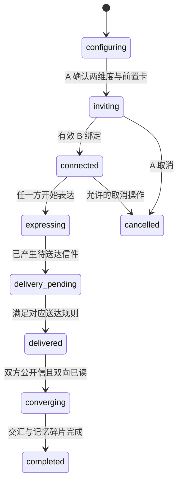
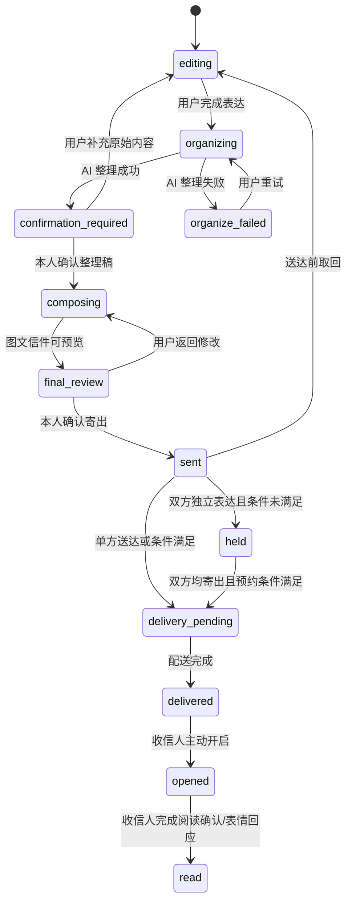
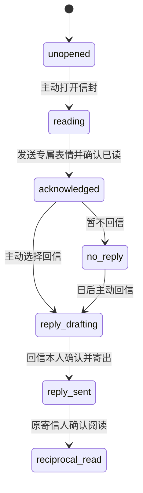
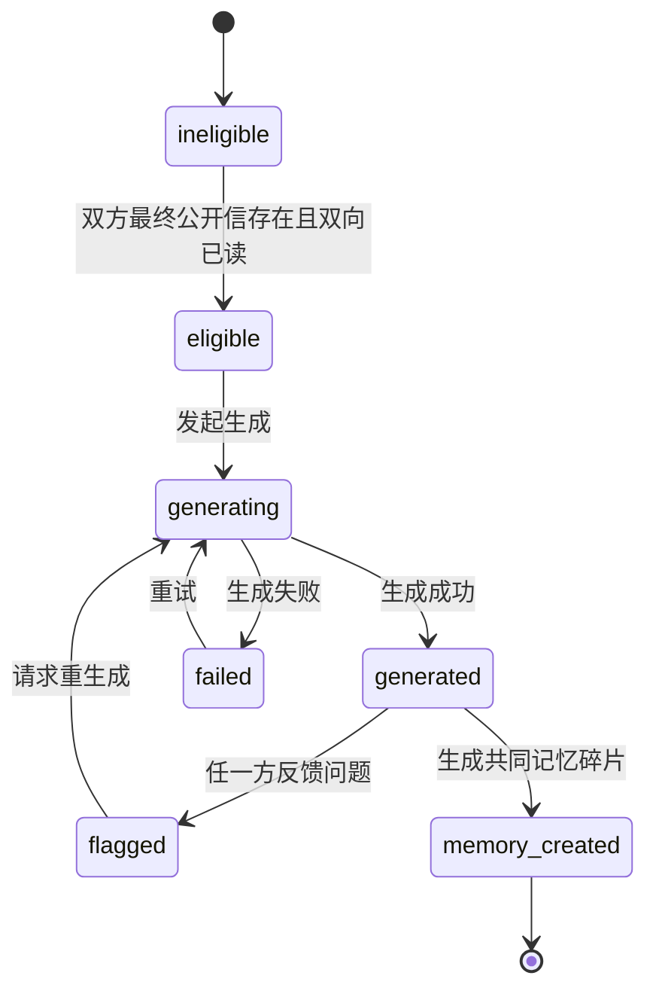
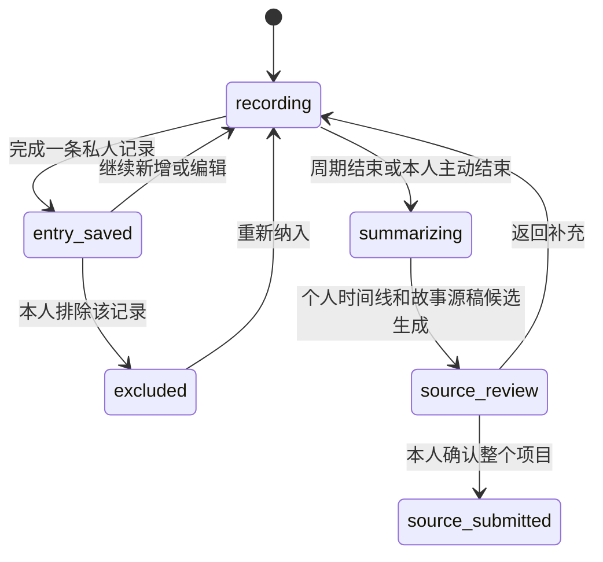
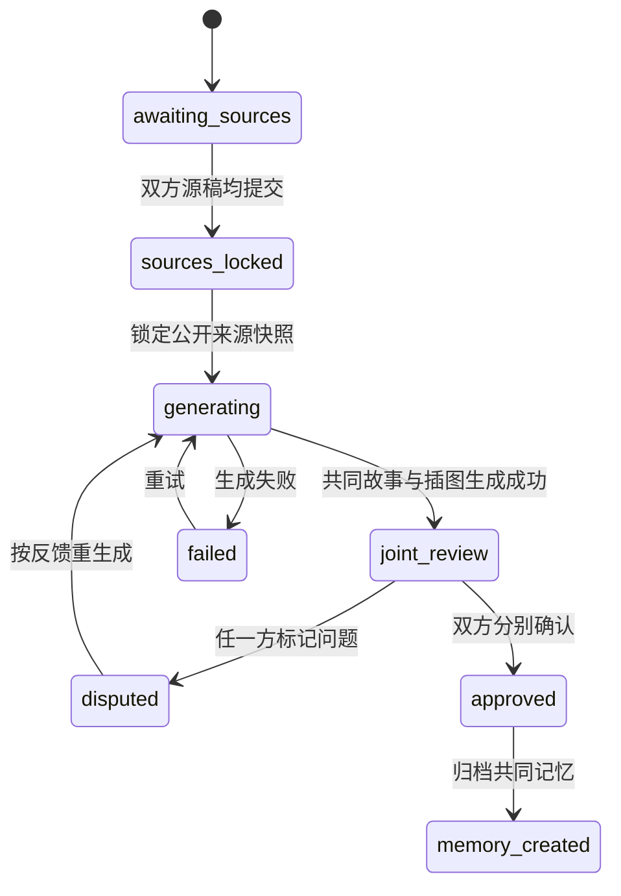

# 状态机设计

> 2026-07 模型补充：`人生片段`按“一段人生/人生周期”实现；信件状态机继续负责送达包装，最终内容实体区分故事源稿、个人绘本和共同绘本。双方独立表达时先托管双方源稿，等待两边提交后才生成共同绘本。

## 1. 状态域

交换、参与者草稿、信件、阅读、回信、AI 交汇和记忆碎片分别维护状态，避免用一个总状态隐含多个并行事实。

## 2. 交换状态

| 状态 | 进入条件 | 退出条件 | 异常处理 |
|---|---|---|---|
| configuring | A 开始创建 | 两维度、前置卡、送达方式均确认 | 校验失败留在当前状态 |
| inviting | 交换和邀请码已创建 | 唯一 B 成功绑定 | 无效/失效/自用邀请码拒绝绑定 |
| connected | A、B 已绑定 | 任一方开始表达 | B 无法识别事件时保持并允许稍后继续 |
| expressing | 有私人草稿或整理任务 | 至少一封信寄出 | 保存失败保留本地恢复信息，不泄露内容 |
| delivery_pending | 有托管或预约信件 | 送达条件满足 | 预约到时但缺信则等待或重约 |
| delivered | 至少一封信已送达 | 双向交汇条件满足或保持单方完成 | 单方无回信时可长期停留 |
| converging | 双方公开信且双向已读 | 交汇成功并生成碎片 | 失败保留原信，允许重试 |
| completed | 共同碎片生成 | 无自动退出 | 共同内容变更需提示双方影响 |

## 3. 草稿与信件状态

关键异常：自动保存失败不得丢弃已录片段；转写/OCR/插图失败不能覆盖原材料；确认后修改正文必须使相关摘要、插图和预览失效；已送达信件不可走普通取回路径。

## 4. 两种交换方式差异

### 双方独立表达

- A、B 各有独立草稿和信件状态机。
- 任一信先进入 `held`，直至双方均为 `sent/held`；预约模式还需到时。
- 两封信必须作为同一送达批次从 `delivery_pending` 进入 `delivered`。
- 对方只能看到粗粒度交换状态，不能读取对方草稿或托管信件正文。

### 我先告诉对方

- A 的信可从 `sent` 直接进入 `delivery_pending`，不等待 B。
- B 阅读并发表情后，A 的单方流程可稳定停留在已读状态。
- B 主动回信时才创建关联回信草稿；回信走完整确认与寄出状态机。
- 不得由系统自动创建回信任务、倒计时或催促状态。

## 5. 阅读与回信状态

阅读位置保存失败允许重新定位；表情发送失败不应错误标记已读；重复请求必须幂等，避免产生多个主要回应。

## 6. AI 交汇与记忆碎片

进入 `eligible` 前必须在服务端重新校验唯一数据源。生成失败、内容被标记或重生成均不得修改两封原信。记忆碎片仅在交汇成功后创建，并与双方空间中的同一实体关联。

## 7. 一段人生记录状态

单条记录的 `entry_saved` 不得推进交换公开状态。双人模式下，对方只能获得项目级 `recording/source_submitted` 投影，不能获得记录数量、日期和媒体元数据。

## 8. 个人与共同绘本状态

### 个人绘本

`source_confirmed → generating → review_required → confirmed → delivery_pending → delivered`

仅“我先告诉对方”模式进入个人绘本流水线。失败回到 `review_required/failed`，不影响源稿。

### 共同绘本

共同绘本的审批按用户分别记录，不允许一个用户替另一方确认。未双确认版本可以回看和继续校对，但不能标记为共同记忆。
